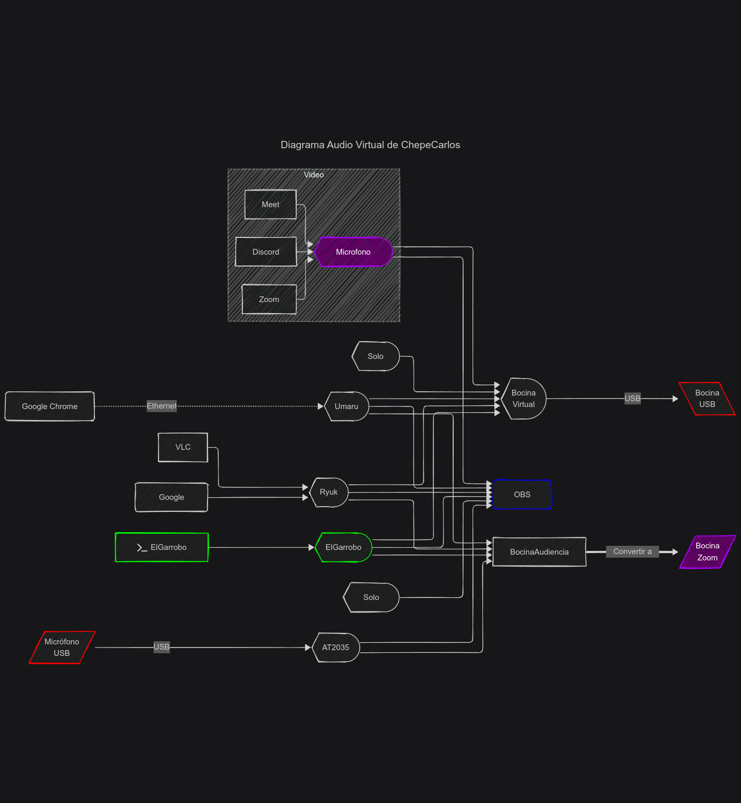

# Sistema Audio virtual de ChepeCarlos

Poder separar los audio y mezclarlo para mejorar la creación de contenido;
 en actividades de grabar, trasmitir y video conferencia

# Cosas por hacer

- [x] Usar PipeWire
- [ ] Auto Inicio del sistema de manera automatica
- [ ] Crear Bocinas virtuales
- [ ] Conectar Bocinas virtuales
- [ ] Separar y agrupar los sonidos para ser grabados en diferentes pistar
- [ ] Crear Micofono para Zoom; desde una bocina
- [ ] Trasmitir audio desde red
- [ ] Desactivar entradas de audio sin usar (micrófono de cámara)
- [ ] Control de Cada Bocina virtuala por medio de machos
- [ ] OBS Recibe las bocinas individuales

# Diagrama 

